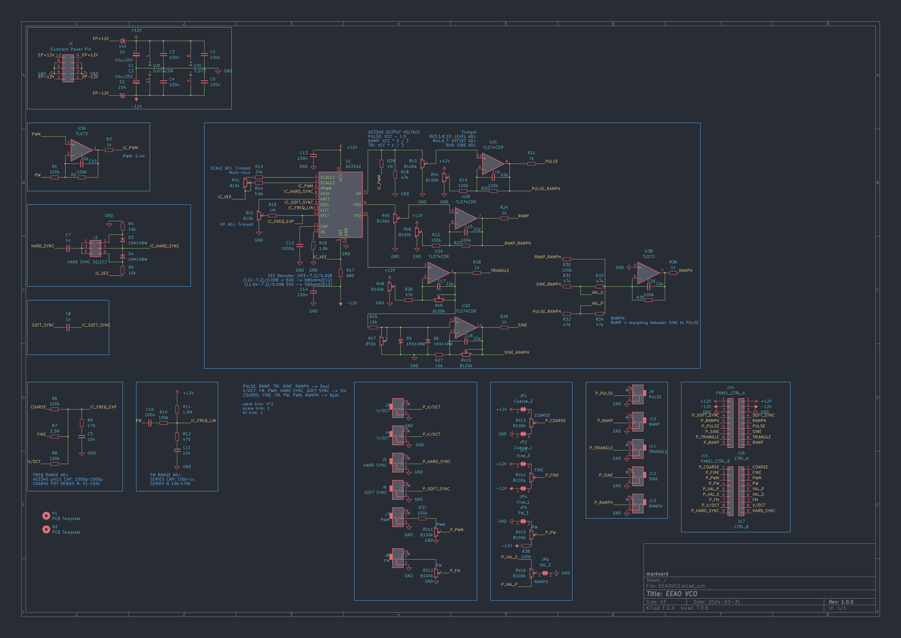

# EEAOVCO
Eurorack 8HP Single VCO using 3340 IC.

## Specification

### Power

|Use Voltage|Current consumption|
|:--|:--|
|+12V|19mA|
|-12V|19mA|

### Input

|Name|Description|
|:--|:--|
|V/OCT||
|FM||
|PWM||
|H.SYNC|NEG/POSI/BOTH are switched by jumpers on the back|
|S.SYNC||

### Output

|Name|Description|
|:--|:--|
|PULSE|Bipoler8Vpp|
|RAMP|Bipoler8Vpp|
|TRIANGLE|Bipoler8Vpp|
|SINE|Bipoler8Vpp|
|RAMPH|Bipoler8Vpp, Morphing between from RAMP+SINE to RAMP+PULSE|

### Controller

|Name|Description|
|:--|:--|
|COARSE|About 0.6Hz～2.8khz|
|FINE|About ~8 semitone|
|PW|Pulse Width|
|PWM|PWM Depth|
|FM|FM Depth|
|RAMPH|Morphing between from RAMP+SINE to RAMP+PULSE|

## Image

## Schematic

## Waveform

Pulse(50%)  
  

Pulse(0%)  
  

Pulse(100%)  
  

Ramp  
  

Triangle  
  

Sine(25%)  
  

Ramph(0%)  
  

Ramph(25%)  
  

Ramph(50%)  
  

Ramph(100%)  
  

Triangle with FM  
  

Triangle with H.Sync(NEG)  
  

Triangle with S.Sync  
  
